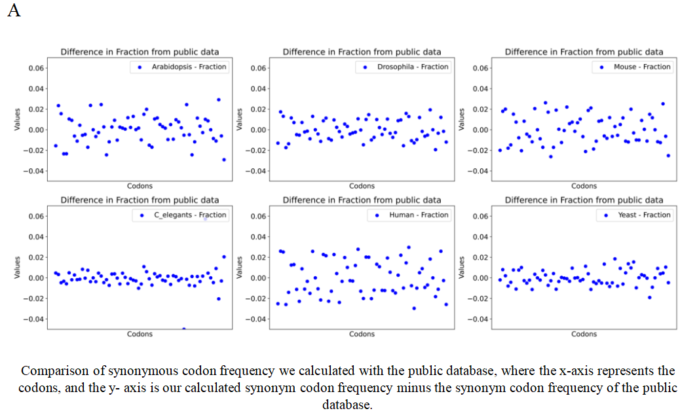
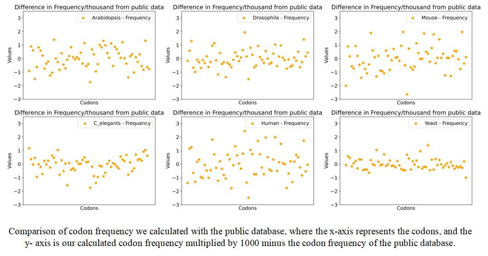
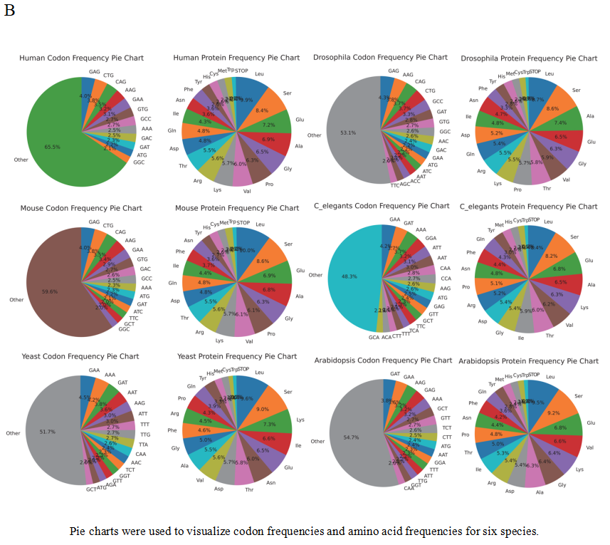
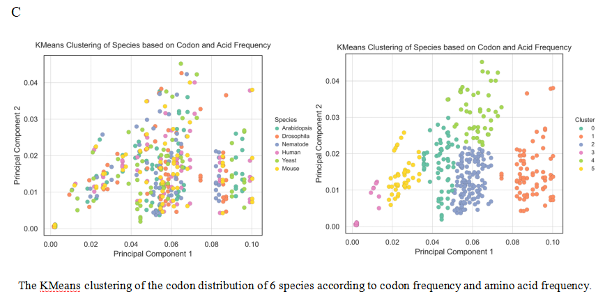
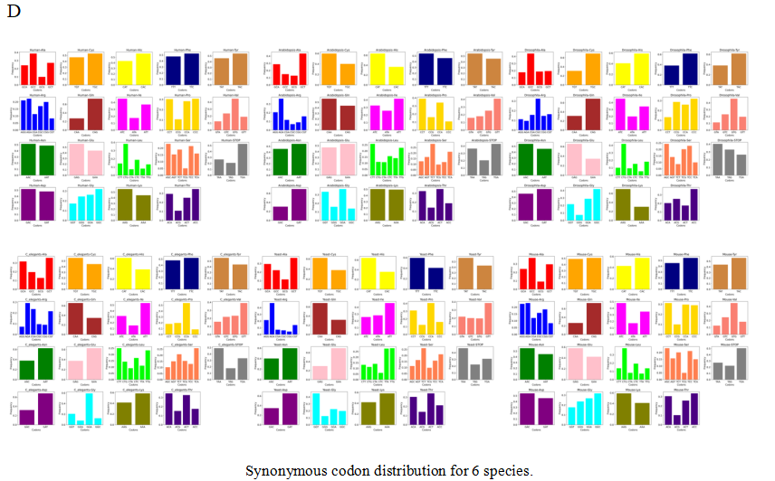

## MED5018_Group1
This is the final project of the first group of MED5018 in Southern University of Science and Technology.The group members include Hunchun Lin, He Yifei, Cao Yingyin, Feng Jianzheng and He Yanan.
## Project Overview
Using the CDS fasta files, we calculate and compare codon frequencies for all species with public data, explored the preferences in codon usage and find patterns.

## library
* pandas
* numpy
* matplotlib.pyplot
* seaborn
* PdfPages
* seaborn
* sklearn.cluster
* sklearn.decomposition


## Key Findings
We find that：
* 1.The results of the compare show that the difference between the data we calculated and public databases is relatively small.
* 2.The amino acids Leu and Ser have the highest frequency, while Tyr, His, Cys, Met, and Trp have the lowest frequency, which exhibits significant consistency.
* 3.We observed that these six species are not distinctly separated when conducting a cluster analysis based on codon and amino acid frequency for six species.
* 4.Mice and humans exhibit similar trends in synonymous codon usage, while Arabidopsis and nematodes have more similar synonym codon preferences.
* 5.As a model mammalian species, the genetic characteristics of mice are similar to those of humans, indicating that the use of model organisms can effectively infer human biological traits in certain biological studies.
## Visualizations 





## Team

```javascript
林涵纯 曹瀛尹 何亚楠 何逸飞 冯健政
```
Everyone contributed equally according to the division of labor as well as their interests.
